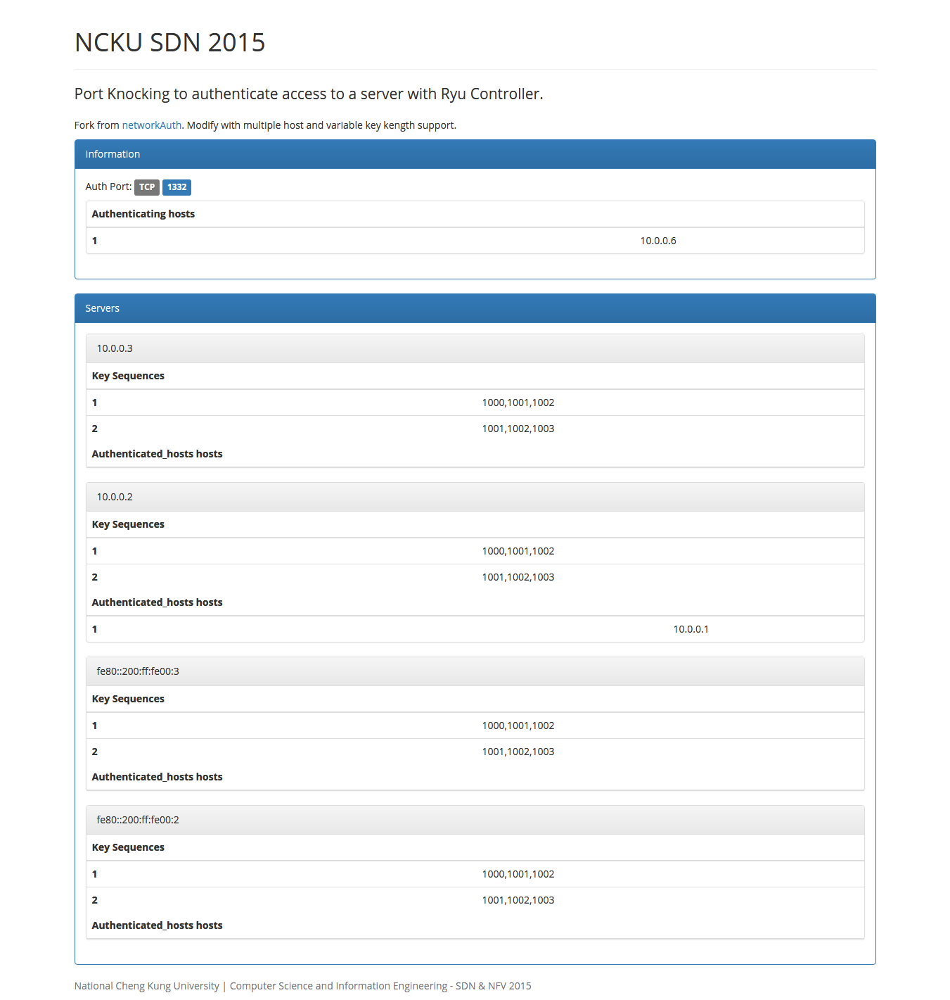

# networkAuth

Uses port knocking in an OpenFlow network to authenticate access to a server host. 

Knocking is performed with a one-time-knock.

Knocks occur using TCP requests to ports on the server, these are intercepted by the controller and matched against known keys.
Port numbers include sequence information for matching out-of-order packets.

Includes a restful interface for viewing the auth-state, creating new knocks and removing access for authenticated hosts.


knock port manually using Mininet:

```bash
h1 nc -q1 -t 10.0.0.2 1332
h1 nc -q1 -t 10.0.0.2 1000
h1 nc -q1 -t 10.0.0.2 1001
h1 nc -q1 -t 10.0.0.2 1002
```


